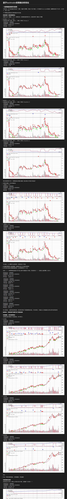
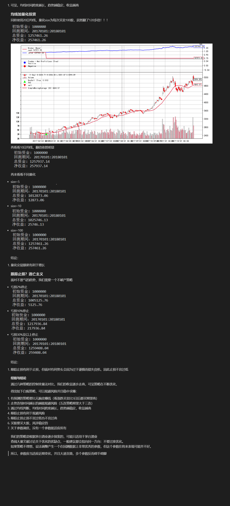

# Abstract
我们小组主要进行了四个方面的工作
* 对大盘和股票进行概述的分析
* 使用简单策略进行买入卖出
* 使用复杂模型进行买入卖出
* 使用爬虫获取股吧评论标题与时间

# Program Structure
```python
策略探索/ # 牛志刚同学对自己stupid_strategy结果的分析
    ....png # 运行结果的截屏
    策略探索.ipynb 
    策略探索.md
...
extra/ # 何振远同学进一步的工作
    评论.csv
    上海电气股吧爬虫.ipynb # 对情感分析的初步工作
    上证和上海电气指数图.ipynb # 对大盘和上海电气数据的概述
...
stupid_strategy/ # 牛志刚同学的简单策略
    dma.py # 绘制任意天的双均线
    runback.py # 基于backtrade的回测函数
    stupidmethod.py # 简单策略的优化与对比
```
     
# Build With
王可立、牛志刚、何振远、董思雯。

## 牛志刚：对于简单策略的分析

