# 用金融数据写一个交易策略 (by:王可立)  
这次主题是用金融数据写一个交易策略，主要有这几个组成部分：
    1 数据的读取，可视化，简单分析。
    2 根据1使用的数据用神经网络设置合理的（超）参数进行预测未来（2018七月至2020七月）走势。
    3 操盘手，以100万人民币为启动资金，计算（一,按预测模型进行投资，二，按照上帝视角进行投资）这两者各自的盈亏情况，通过误差分析总结出最佳投资策略。
     
## 组员
王可立、牛志刚、何振远、董思雯。
## 分工
1-何振远：对18年以前的股票做分析报告+投研
2-董思雯：预测+根据预测的数据写出策略
3-牛志刚：根据18-20年上帝视角写傻瓜策略（对标：一些金融嗅觉比较敏锐的人/运气好的人）
4-王可立：根据董思雯和牛志刚的策略分别计算策略的收益加上策略的每个动作点的收益对比
## 一些策略的探索与回测（by：牛志刚）
不禁在想，对于变化的股市有没有“一招鲜，吃遍天”的策略，我进行了如下探索，以下探索基于back trader的回测，回测期间使用17年全年，无代理人，本金一百万。

19个策略层层递进进行控制变量法对比实验

### 买涨买跌？看连续趋势法  
   预测完全是一种赌博，不少人（新鲜韭菜）采用跟风看趋势的方式，真的有效吗？测试以下策略
* 高买低卖（-4.13）（+1.88）
    * K线收盘价出现三连涨，则买入，三连跌，则卖出（keepup_3）
        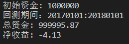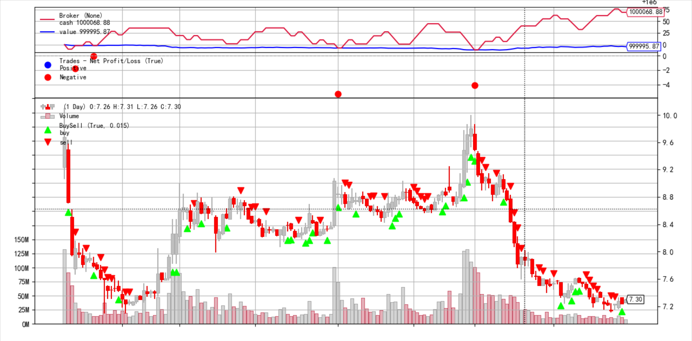 
    * K线收盘价出现五连涨，则买入，五连跌，则卖出（keepup_5）
        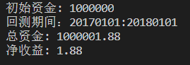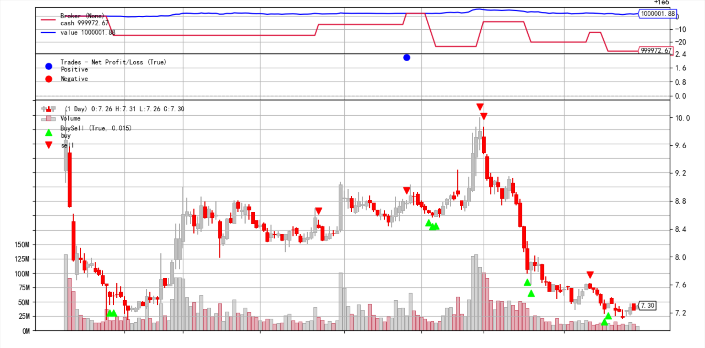
* 高卖低买（+1.75）（-2.34）
    * K线收盘价出现三连跌，则买入，三连涨，则卖出（keepdown_3）
      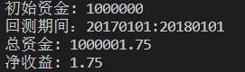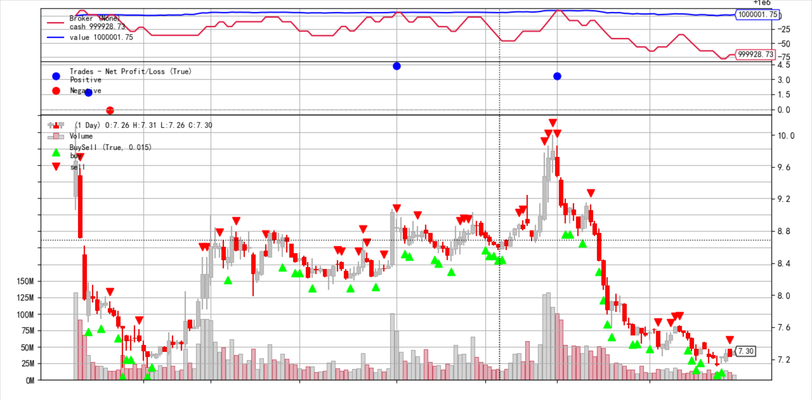
    * K线收盘价出现五连跌，则买入，五连涨，则卖出（keepdown_5）
      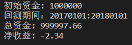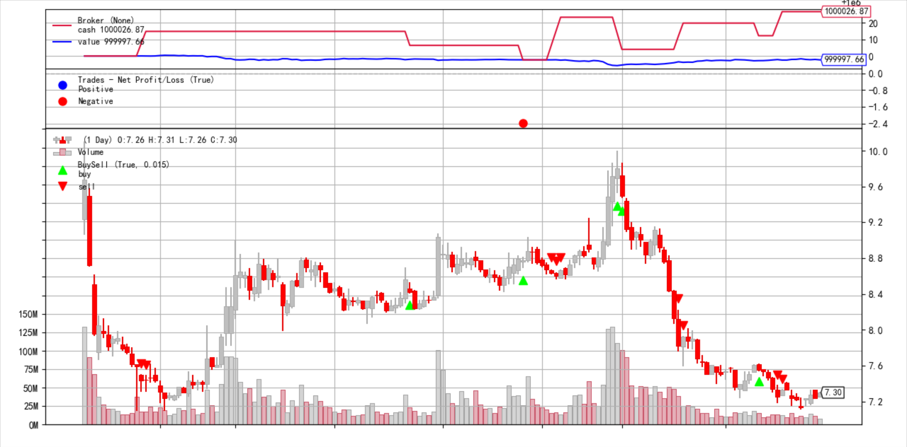
我们发现效果并不好，主要原因是走势难以预测，那么我们以不变应万变试试？
* 仍然是买涨跌，但5日后都卖出
    * 三连涨买（-2.13）
        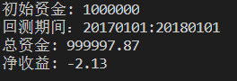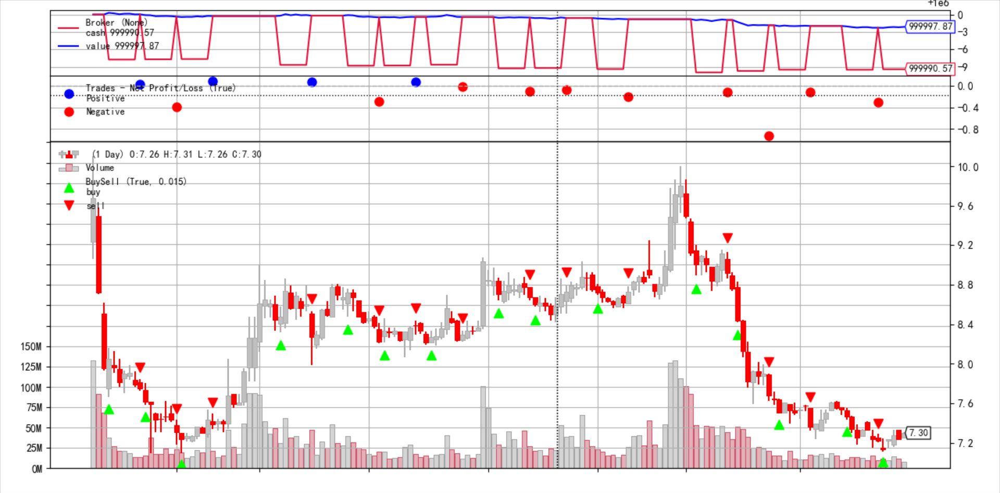
    * 三连跌买（-4.01）
        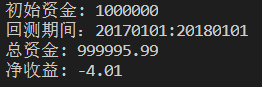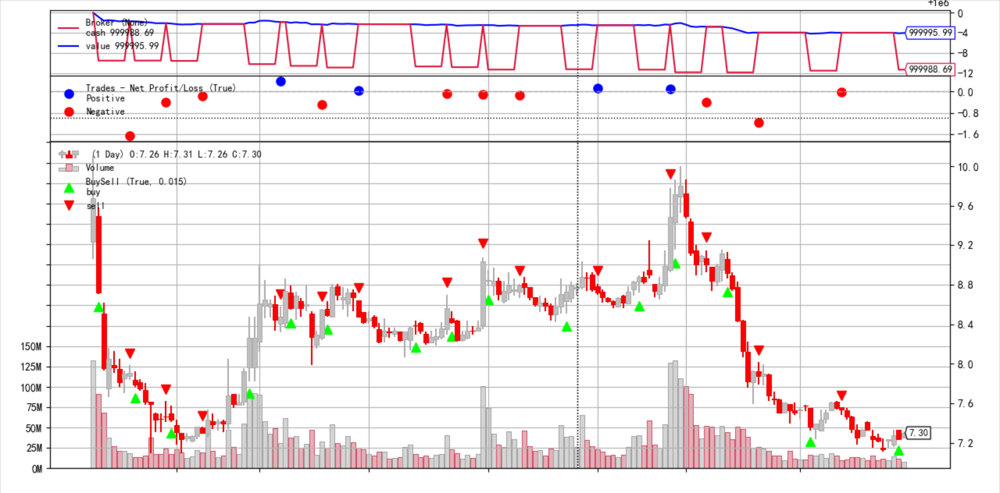

可以看出，以上策略并无必然优势，但是得出以下经验：
1. 有预测的策略要比无脑卖赚钱（看涨跌买卖比5日后都买期望高）
2. 走势连续时间越长的越能规避风险（五连策略期望大于三连）
但是！！！！突然想到这应该是不争气的上海电气搞得盈亏不明显，我们换茅台！！！
仍然是上面的策略，依次为：

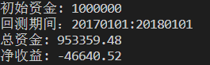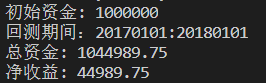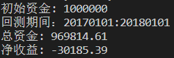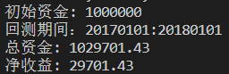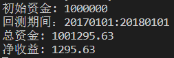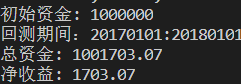

惊人的发现，上面的经验仍然适用，看来我们得到了可靠的模型和经验，并告诉我们，尽量选大公司的股票以及势头常年风评较好的

* **最终结论：可能投资电气股票不是个明智的选择**

### 均线辅助，双均线预测法
该策略收盘时判断低于均线则卖出，高于则买入
* 5日均线
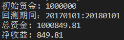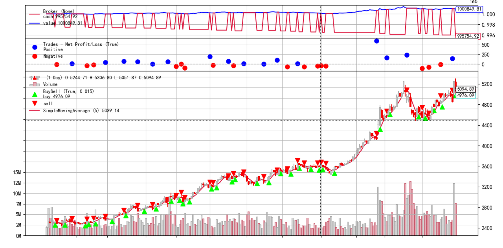
* 10日均线
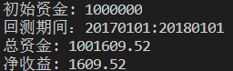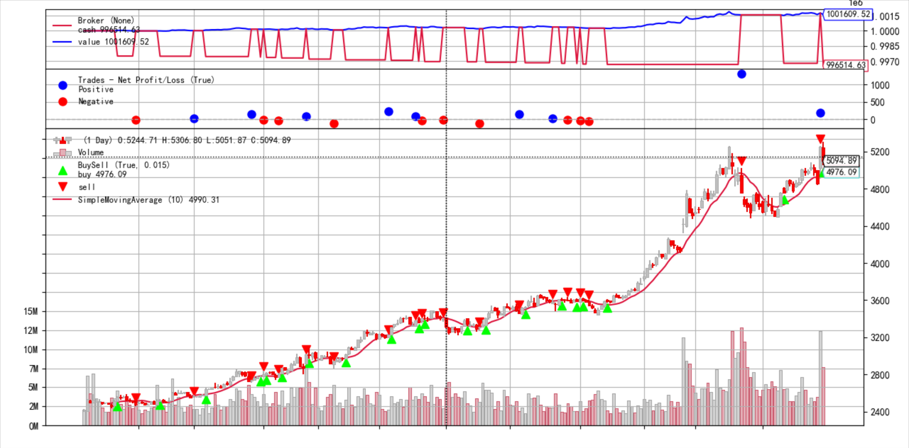
* 15日均线
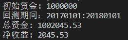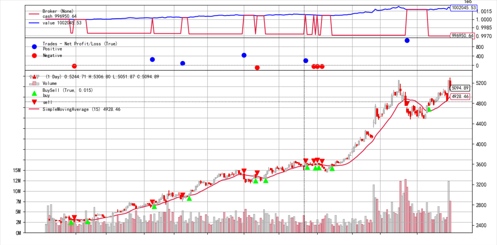
* 20日均线
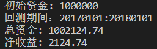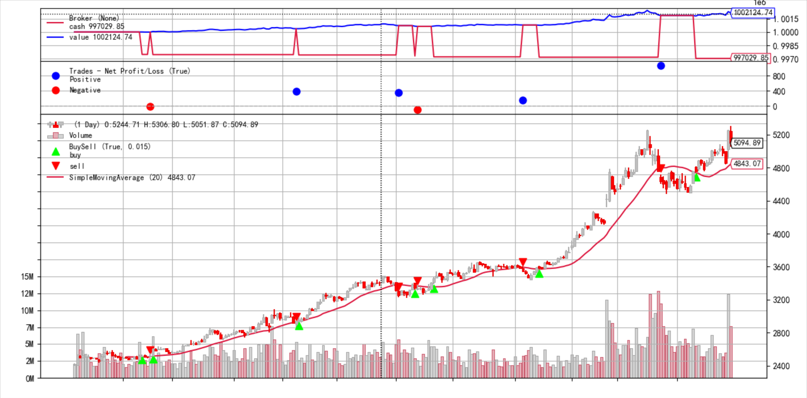

结论
1. 可见，均线时间跨度越长，趋势越稳定，收益越高

### 均线加量化投资
同样使用20日均线，量化size为每次买卖100股，居然翻了120多倍！！！
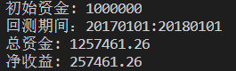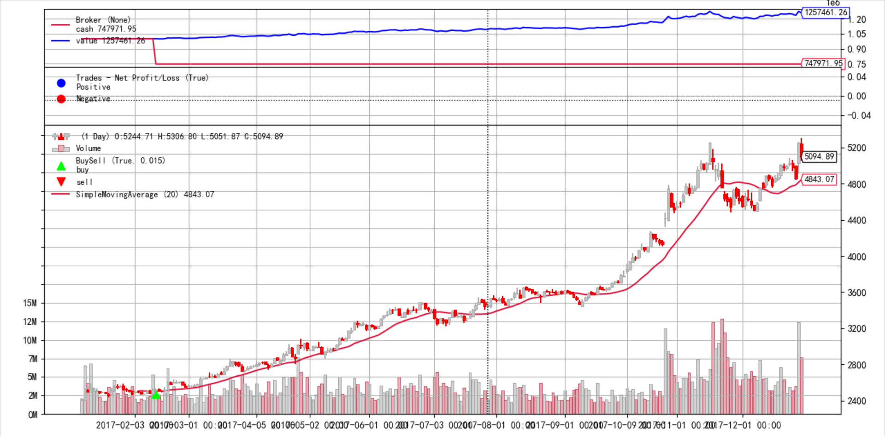
再看看10日均线，翻倍依然明显
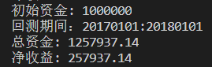

再来看看不同量化
* size=5
  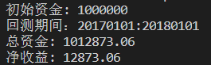
* size=10
  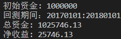
* size=100
  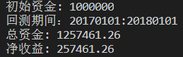

结论：
1. 量化交易额更有利于增长

### 跟踪止损？逃亡主义
面对不景气的
* 亏损2%停止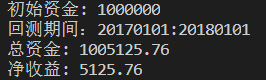
* 亏损10%停止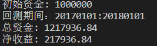
* 亏损30%及以上停止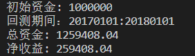
  
结论：
1. 跟踪止损有利于止损，但面对有利势头会因为过于谨慎而错失良机，因此止损不宜过低

#### 经验与结论
通过几种策略的控制变量法对比，我们的收益逐步走高，可见策略在不断优化，

得出如下白痴策略，可以规避风险并且稳中求赚：

1. 有预测的策略要比无脑卖赚钱（看涨跌买卖比5日后都买期望高）
2. 走势连续时间越长的越能规避风险（五连策略期望大于三连）
3. 通过均线判断，均线时间跨度越长，趋势越稳定，收益越高
4. 跟踪止损有利于规避风险
5. 跟踪止损止损不宜过低也不宜过高
6. 买股要买大股，风评稳定的
7. 关于参数调优，没有一个参数能适应所有
   
我们的策略是根据茅台酒业逐步探索的，可能只适用于茅台酒业  
查阅大量文献讨论关于优化的优缺点，一般建议都会指向同一方向：不要过度优化。  
如果策略不理想，设法调整产生一个在回测数据上非常优秀的参数，但这个参数在将来表现可能并不好。

所以，参数应当适应近期变化，并且大道至简，多个参数反而碍手碍脚

## 上证和上海电气指数图
通过上证指数来分析中国股市的基本情况，从近三年的数据来看，2016年底稳步上升，偶尔有几次大回落。较为惨烈的是2018年2月开始的一场大股灾，随后的跌落潮持续了整整一年，直到2019年初才恢复有所上升。同时粗略来看，几乎每次年初都会有一定的下跌，猜测原因是过年大家想存有更多的现金购置年货，导致股价下跌，这是投资时值得注意的时间点。

同时也有突发事件，比如covid-19带来的停市以及对经济的影响很大，还有国际地缘政治摩擦，国际事件影响都会不同程度地影响股市大盘，国内影响如七月节日涨停等。今年突发事件较多，可以看到最近大盘指数点一直都在震荡，投资需要谨慎。
我们选取了同我们专业相关的一家大型上市公司，上海电气是一家大型综合性高端装备制造企业，主导产业聚焦能源装备、工业装备、集成服务三大领域，致力于为全球客户提供绿色、环保、智能、互联于一体的技术集成和系统解决方案。产品包括火力发电机组（煤电、气电）、核电机组、风力发电设备、输配电设备、环保设备、自动化设备、电梯、轨道交通、医疗设备、油气海工和工业互联网等。改革开放以来，集团诞生了一大批世界领先的创新产品，如全球首台百万千瓦超超临界二次再热发电机组、三代四代核电核岛和常规岛主设备、大型海上风电设备、西气东输的高频电动机等。
详见《上海电气2019年年度报告.pdf》

对于股价的分析，整体趋势上来看股价近几年下跌趋势很明显，猜想可能是新兴互联网产业对老工业体系的冲击较大，同时由于中美贸易摩擦，国际对中国印象变差，导致一带一路等外输建设各方面成本增大，进度减缓。其余涨跌与大盘接近，最近稳定了下来，股价与同类型企业相似，可以考虑投资。

对2017年停牌的了解，由于公司对债券等资产进行重组。
详见《督导报告总结书.pdf》
