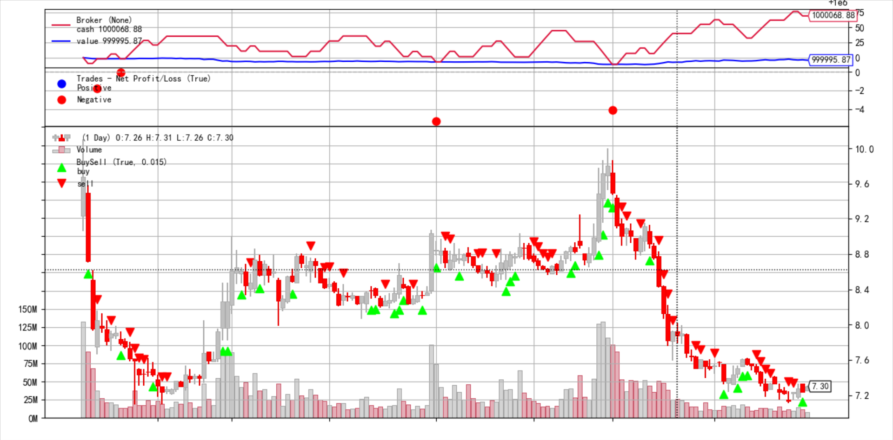
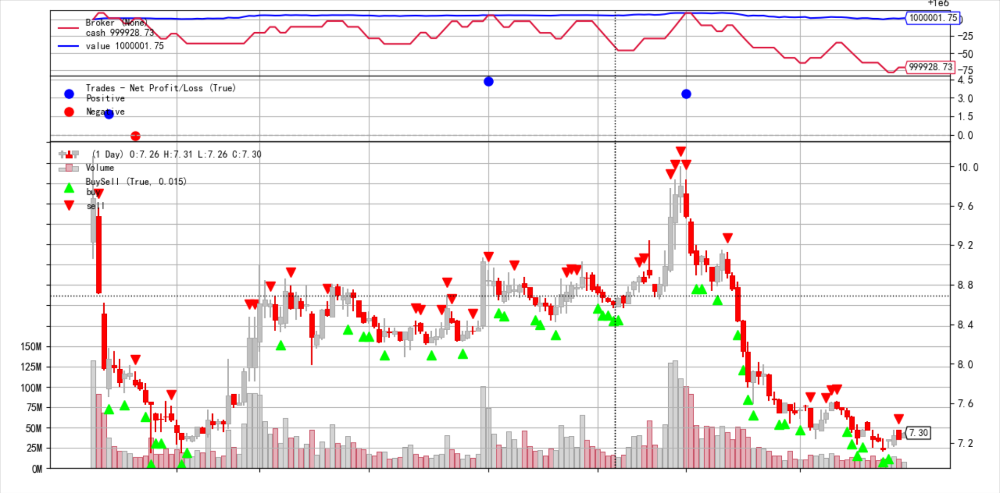
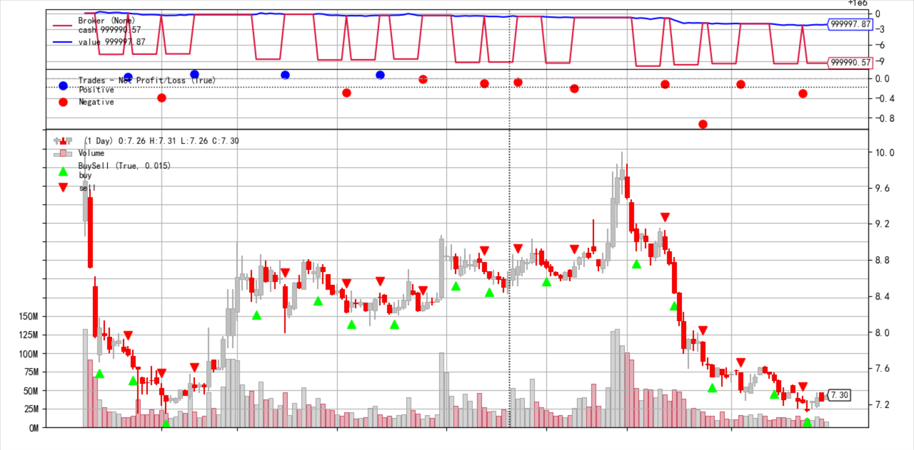
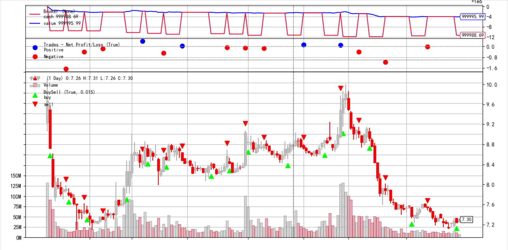
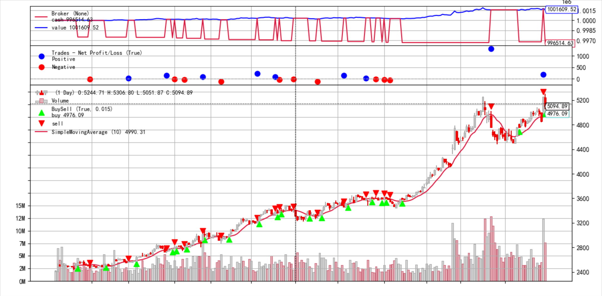

# 基于backtrader的策略分析优化
## 一些策略的探索与回测
不禁在想，对于变化的股市有没有“一招鲜，吃遍天”的策略，我进行了如下探索，以下探索基于back trader的回测，回测期间使用17年全年，无代理人，本金一百万。

19个策略层层递进进行控制变量法对比实验

### 买涨买跌？看连续趋势法  
   
   预测完全是一种赌博，不少人（新鲜韭菜）采用跟风看趋势的方式，真的有效吗？测试以下策略

* 高买低卖（-4.13）（+1.88）  
    * K线收盘价出现三连涨，则买入，三连跌，则卖出（keepup_3）  
          
           
    * K线收盘价出现五连涨，则买入，五连跌，则卖出（keepup_5）  
          
          
* 高卖低买（+1.75）（-2.34）  
    * K线收盘价出现三连跌，则买入，三连涨，则卖出（keepdown_3）  
        
        
    * K线收盘价出现五连跌，则买入，五连涨，则卖出（keepdown_5）  
        
        

我们发现效果并不好，主要原因是走势难以预测，那么我们以不变应万变试试？

* 仍然是买涨跌，但5日后都卖出  
    * 三连涨买（-2.13）  
          
          
    * 三连跌买（-4.01）  
          
          

可以看出，以上策略并无必然优势，但是得出以下经验：  
1. 有预测的策略要比无脑卖赚钱（看涨跌买卖比5日后都买期望高）
2. 走势连续时间越长的越能规避风险（五连策略期望大于三连）

但是！！！！突然想到这应该是不争气的上海电气搞得盈亏不明显，我们换茅台！！！
仍然是上面的策略，依次为：

  
   
  
  
  
  

惊人的发现，上面的经验仍然适用，看来我们得到了可靠的模型和经验，并告诉我们，尽量选大公司的股票以及势头常年风评较好的

* **最终结论：可能投资电气股票不是个明智的选择**

### 均线辅助，双均线预测法

该策略收盘时判断低于均线则卖出，高于则买入

* 5日均线  
  
* 10日均线  
  
* 15日均线  
  
* 20日均线  
  

结论
1. 可见，均线时间跨度越长，趋势越稳定，收益越高

### 均线加量化投资
同样使用20日均线，量化size为每次买卖100股，居然翻了120多倍！！！  

  
再看看10日均线，翻倍依然明显  
  

再来看看不同量化

* size=5  

* size=10  

* size=100  

结论：
1. 量化交易额更有利于增长

### 跟踪止损？逃亡主义
面对不景气的趋势，我们需要一个不破产策略

* 亏损2%停止  

* 亏损10%停止  

* 亏损30%及以上停止  

  
结论：  
1. 跟踪止损有利于止损，但面对有利势头会因为过于谨慎而错失良机，因此止损不宜过低

#### 经验与结论

通过几种策略的控制变量法对比，我们的收益逐步走高，可见策略在不断优化，

得出如下白痴策略，可以规避风险并且稳中求赚：

1. 有预测的策略要比无脑卖赚钱（看涨跌买卖比5日后都买期望高）
2. 走势连续时间越长的越能规避风险（五连策略期望大于三连）
3. 通过均线判断，均线时间跨度越长，趋势越稳定，收益越高
4. 跟踪止损有利于规避风险
5. 跟踪止损止损不宜过低也不宜过高
6. 买股要买大股，风评稳定的
7. 关于参数调优，没有一个参数能适应所有
   
我们的策略是根据茅台酒业逐步探索的，可能只适用于茅台酒业  
查阅大量文献讨论关于优化的优缺点，一般建议都会指向同一方向：不要过度优化。  
如果策略不理想，设法调整产生一个在回测数据上非常优秀的参数，但这个参数在将来表现可能并不好。

所以，参数应当适应近期变化，并且大道至简，多个参数反而碍手碍脚